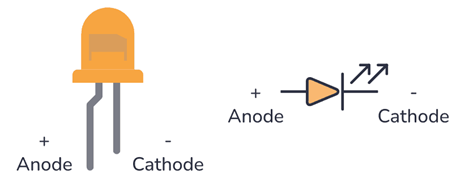
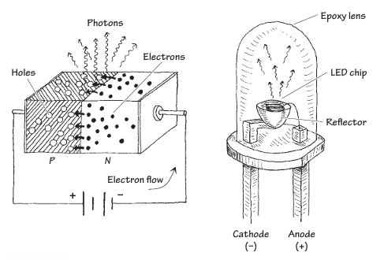

<h1>LED_Blink, "Hello World" di Embedded System</h1>

Pada pertemuan sebelumnya, LED dinyalakan dengan menghubungkannya langsung ke sumber tegangan Arduino. Cara ini membantu kita mengenal pin daya dan ground serta cara menghubungkan komponen elektronik, tetapi fungsinya masih sangat sederhana.

Pada pertemuan ini, pembelajaran naik satu tingkat. LED tidak lagi menyala secara langsung, melainkan dikendalikan oleh program. Arduino akan mengatur tegangan pada pin GPIO sehingga LED dapat dinyalakan dan dimatikan sesuai perintah kode. Melalui kegiatan ini, kita mulai mempelajari dua keterampilan utama dalam sistem mikrokontroler, yaitu merancang rangkaian elektronik dan membuat program yang mengontrol rangkaian tersebut.

Pada tugas pendahuluan, sebuah LED diperlukan. Dalam hal ini, anode pada LED (berkaki Panjang) dihubungkan pada Pin 11 dan katoda (berkaki pendek) dihubungkan ke pin GND seperti yang terlihat pada Gambar. LED akan dikendalikan menggunakan program. Kita akan membuat kode C/C++ pada Arduino sehingga Pin 11 diberi tegangan 5V secara otomatis, yang menyebabkan LED menyala.

<h2>Membuat Rangkaian</h2>

<h2>Alat dan Bahan</h2>

Berikut adalah alat dan bahan pada percobaan LED Blink dengan menggunakan Arduino:

<table border="1" cellpadding="10" cellspacing="0" width="100%">
  <tr>
    <th>Arduino</th>
    <th>LED</th>
    <th>Resistor</th>
  </tr>

  <tr align="center">
    <td>
       
    </td>
    <td>
       
    </td>
    <td>
       
    </td>
  </tr>

  <tr align="center">
    <td>Arduino Uno, Leonardo, atau lainnya</td>
    <td>Red LED</td>
    <td>220Ω Resistor atau lainnya</td>
  </tr>
</table>

Pastikan sambungkan wiring kabel sesuai dengan petunjuk berikut:
<ul>
  <li>(+) LED -------------- Resistor</li>
  <li>(-) LED -------------- Pin GND</li>
  <li>Resistor ------------- Pin 11</li>
</ul>

<h2>Light Emitting Diode (LED)</h2>

Light-Emitting diode (LED) adalah perangkat berkaki dua yang mirip dengan dioda sambungan PN (pn-junction diode), kecuali bahwa LED dirancang untuk memancarkan cahaya tampak atau cahaya inframerah. Ketika kaki anoda LED diberi tegangan yang lebih positif dibandingkan kaki katodanya (dengan besar tegangan minimal sekitar 0,6 hingga 2,2 volt), maka arus listrik akan mengalir melalui perangkat tersebut dan cahaya akan dipancarkan. Namun, jika polaritas tegangan dibalik (anoda dibuat lebih negatif daripada katoda), maka LED tidak akan menghantarkan arus, sehingga tidak memancarkan cahaya. Simbol LED ditunjukkan pada gambar.

   
  Gambar 2.1 Simbol dari Light-Emitting Diode

LED tersedia dalam berbagai macam warna. Secara historis, LED berwarna merah adalah jenis LED yang pertama kali dikembangkan. Setelah itu, menyusul LED berwarna kuning, hijau, dan inframerah. Baru pada tahun 1990-an, LED berwarna biru berhasil dikembangkan. Saat ini, LED tersedia dalam hampir semua warna, termasuk warna putih. Selain itu, terdapat juga LED berdaya tinggi (high-power LED) yang digunakan untuk pencahayaan, serta OLED (Organic Light Emitting Diode) yang dibuat dari bahan polimer dan dapat digunakan sebagai layar (display).

Sering kali, LED (terutama LED inframerah) digunakan sebagai elemen pemancar (transmitter) dalam rangkaian pengendali jarak jauh (remote control), misalnya pada remote TV. Pada khasus ini, elemen penerima (receiver) dapat berupa fototransistor yang merespons perubahan intensitas cahaya LED dengan mengubah besar arus listrik yang mengalir di dalam rangkaian penerima tersebut.

Bagian pemancar cahaya pada LED dibuat dengan menggabungkan semikonduktor tipe-n dan tipe-p sehingga membentuk sambungan pn (pn junction). Ketika sambungan pn ini diberi bias maju (forward bias), elektron-elektron pada sisi n tereksitasi melintasi sambungan pn dan masuk ke sisi p, tempat mereka berkombinasi dengan hole. Pada saat elektron-elektron tersebut berkombinasi dengan hole, foton (cahaya) dipancarkan. Secara umum, bagian sambungan pn LED dibungkus dalam cangkang epoksi yang diberi partikel penyebar cahaya untuk menyebarkan cahaya dan membuat LED tampak lebih terang. Sering kali, sebuah reflektor ditempatkan di bawah bahan semikonduktor untuk mengarahkan cahaya ke atas. Kaki katoda dan anoda dibuat dari konduktor berpenampang besar (heavy-gauge) untuk membantu mengalirkan panas menjauh dari semikonduktor. Secara ilustrasi cara LED bekerja terdapat pada gambar.

   
  Gambar 2.2 Cara Kerja LED dan Bentuk Penampang LED

<h2>Resistor</h2>

<h2>Menghidupkan dan Mematikan LED pada Pin 11 Dengan Menggunakan Program</h2>

https://github.com/user-attachments/assets/d73ae3f6-8689-45e6-a6dd-03096f7abbfc

LED Blink sebagai project Hello World di Embedded System dapat disimak sebagai berikut:

<table border="1" align="center" width="100%" cellpadding="0" cellspacing="0">
  <tr>
    <td>
      <h2>
        <a href="led_blink.ino">
          LED Blink Dengan Arduino
        </a>
      </h2>
    </td>
  </tr>
</table>

<h2>Pembelajaran Selanjutnya</h2>

Pada pembelajaran selanjutnya yang akan dipelajari dan dipraktikan adalah komunikasi serial. Praktikum komunikasi serial pada Arduino adalah metode pembelajaran pengiriman data bit demi bit secara berurutan, biasanya melalui kabel USB antara Arduino dan komputer, untuk memantau sensor atau mengontrol output (LED/motor) secara real-time. Praktikum ini menggunakan Serial Monitor di Arduino IDE untuk komunikasi dua arah, sering kali menerapkan fungsi Serial.begin(), Serial.print(), dan Serial.read().

LED Blink sebagai project Hello World di Embedded System dapat disimak sebagai berikut:

<table border="1" align="center" width="100%" cellpadding="0" cellspacing="0">
  <tr>
    <td>
      <h2>
        <a href="led_blink.ino">
          Next: Serial Communication
        </a>
      </h2>
    </td>
  </tr>
</table>
<h2></h2>

