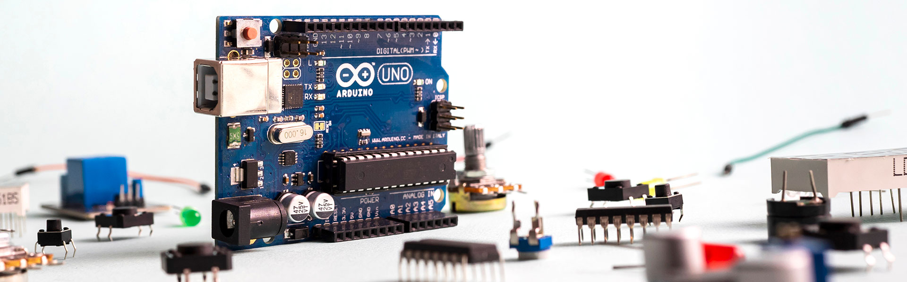
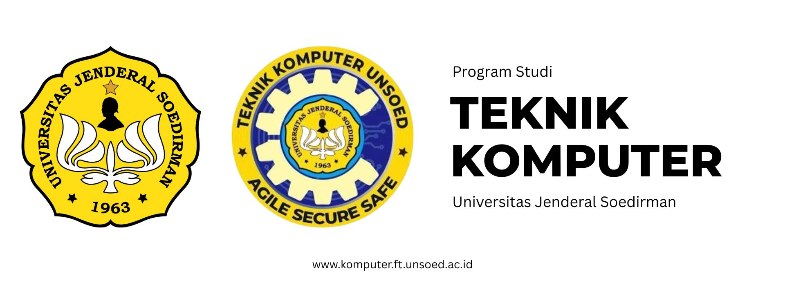

# Embedded System dan Mikrokontroler
<h1>Selamat Datang di Mata Kuliah Embedded System dan Sistem Mikrokontroler</h1>

Mikrokontroler adalah inti sistem embedded. Mikrokontroler hanyalah IC tunggal yang tidak dapat langsung digunakan tanpa rangkaian pendukung. Project board hadir sebagai solusi untuk mempermudah proses belajar dan eksperimen. Arduino merupakan project board yang mengintegrasikan mikrokontroler dengan rangkaian pendukung sehingga siap digunakan.

Untuk memahami Arduino, terlebih dahulu kita harus memahami terlebih dahulu apa yang dimaksud dengan physical computing. Physical computing adalah membuat sebuah sistem atau perangkat fisik dengan menggunakan software dan hardware yang sifatnya interaktif yaitu dapat menerima rangsangan dari lingkungan dan merespon balik. Arduino dikatakan sebagai sebuah platform dari physical computing yang bersifat open source.

<h2>Mengapa Mempelajari Physical Computing?</h2>

Physical computing dipelajari karena memungkinkan komputer berinteraksi langsung dengan dunia fisik melalui sensor dan aktuator, sehingga komputasi tidak lagi terbatas pada layar, tetapi hadir secara kontekstual, cerdas, dan bermakna dalam kehidupan nyata. Selain itu, mempelajari physical computing karena adanya tiga tren teknologi dan sosial yang saling berkaitan:
<ul>
  <li>Physical computing menjadi sangat relevan saat ini karena perkembangan teknologi dan perubahan cara manusia berinteraksi dengan komputer. Gerakan DIY dan komunitas maker membuat perangkat keras seperti Arduino mudah diakses oleh siapa saja, sehingga kita bisa dengan cepat membuat dan menguji sistem yang menggabungkan bentuk fisik dan komputasi. Selain itu, banyak tutorial dan sumber belajar tersedia secara gratis di internet.</li>
  <li>Komputer tidak lagi hanya berbentuk PC atau laptop. Smartphone dan perangkat IoT selalu aktif dan berada di sekitar kita, serta dilengkapi dengan berbagai sensor yang memungkinkan komputer memahami gerakan, posisi, dan kondisi lingkungan. Hal ini membuka peluang interaksi baru yang tidak bergantung pada layar, keyboard, atau mouse.</li>
  <li>Kemajuan machine learning dan computer vision memungkinkan data dari sensor diolah secara cerdas untuk menciptakan interaksi manusia–komputer yang lebih alami, tanpa mengharuskan pengguna menjadi ahli di bidang kecerdasan buatan.</li>
</ul>

Dengan kondisi ini, cara berinteraksi dengan komputer tidak lagi terbatas pada antarmuka grafis tradisional seperti jendela, ikon, menu, dan pointer. Physical computing menghadirkan model interaksi baru yang lebih kontekstual, alami, dan terhubung langsung dengan dunia fisik.

<h2>Prasyarat Pembelajaran</h2>

Untuk mengikuti materi ini, peserta diharapkan sudah memiliki pengalaman dasar dalam pemrograman, seperti memahami variabel, perulangan, fungsi, dan percabangan. Pemrograman mikrokontroler akan menggunakan bahasa C/C++, tetapi peserta tidak harus sudah menguasai C/C++ sebelumnya. Jika sudah pernah menggunakan bahasa seperti Java, C#, atau Python, proses belajar C/C++ akan relatif mudah karena konsep dasarnya serupa. Pada tahap lanjutan, peserta akan diperkenalkan pada konsep pemrograman yang lebih kompleks, seperti pengelolaan memori dan pembuatan library.

Di sisi lain, peserta lebih baik memiliki pengalaman di bidang perangkat keras atau elektronika. Meskipun materi akan dimulai dari dasar sehingga dapat diikuti oleh pemula di bidang hardware.

Physical computing merupakan bidang lintas disiplin yang menggabungkan banyak area keilmuan, seperti teknik elektro, ilmu komputer, interaksi manusia–komputer, dan kecerdasan buatan. Karena cakupannya sangat luas, materi yang disajikan difokuskan pada topik-topik inti yang relevan bagi mahasiswa dengan latar belakang teknik atau informatika.

<h2>Install Arduino IDE</h2>

Sebelum mulai memprogram Arduino, pastikan <a href="https://support.arduino.cc/hc/en-us/articles/360019833020-Download-and-install-Arduino-IDE">Arduino IDE</a> sudah terpasang di komputer Anda. Jika belum, unduh dan instal Arduino IDE dengan mengikuti panduan instalasi yang disediakan secara bertahap melalui tautan berikut <a href="https://support.arduino.cc/hc/en-us/articles/360019833020-Download-and-install-Arduino-IDE#installation-instructions">disini</a>

<h2>Pengenalan GPIO</h2>

Pada tahap ini, kita mulai menyalakan LED menggunakan program dengan memberikan logika HIGH (5V) pada Pin 11. Selanjutnya, program tersebut akan diubah sehingga LED tidak hanya menyala terus, tetapi juga dapat berkedip. Untuk itu, kita perlu memahami konsep keluaran digital pada Arduino.

Arduino Uno memiliki 20 pin GPIO yang dapat digunakan untuk menerima atau mengirim sinyal digital, yaitu HIGH dan LOW. Sinyal ini dikendalikan melalui fungsi digitalRead() untuk membaca dan digitalWrite() untuk menulis nilai digital.

Walaupun pin digital lain juga bisa digunakan, Pin 11 dipilih agar konsisten dengan pelajaran selanjutnya, sehingga proses belajar menjadi lebih sederhana dan tidak membingungkan.

Anda dapat mengendalikan salah satu dari 20 pin digital I/O tersebut dengan menggunakan tiga fungsi berikut:

<ul>
  <li>pinMode(int pin, int mode). Fungsi ini digunakan untuk mengatur sebuah pin agar berfungsi sebagai INPUT atau OUTPUT. Dalam kasus ini, kita memilih OUTPUT karena kita ingin mengirimkan sinyal untuk menyalakan LED.</li>

<li>digitalRead(int pin). Fungsi ini digunakan untuk membaca sinyal digital dari pin tertentu, yaitu HIGH atau LOW. Fungsi digitalRead akan dibahas lebih lanjut pada seri pelajaran pengantar input.</li>

<li>digitalWrite(int pin, int value). Fungsi ini digunakan untuk mengirimkan sinyal digital ke pin tertentu, yaitu HIGH atau LOW. Pada pelajaran ini, kita akan menggunakan fungsi digitalWrite.</li>
</ul>

<h3>Bagaimana kita menghitung 20 pin I/O digital?</h3>

Pada Arduino Uno dan Leonardo, tulisan dan label pada papan sering membuat kita mengira hanya ada 14 pin digital. Padahal, jika dilihat secara keseluruhan, terdapat 20 pin digital I/O yang bisa digunakan. Untuk memastikan hal ini, kita dapat melihat diagram pinout resmi Arduino Uno yang menunjukkan semua pin yang tersedia.

Untuk lebih jelasnya, berikut pin I/O digtial dan analog

<h2>Modul Praktikum Embedded System dan Mikrokontroler</h2>
Dalam modul ini berisi kegiatan berkesinambungan tentang penggunaan arduino uno sebagai project board untuk mikrokontroler baik secara teori maupun langkah-langkah pengerjaan. Berikut modulnya:

<h3><a href="/Modul 1: Konsep GPIO">Konsep GPIO</a></h3>

Praktikum ini membahas penggunaan pin GPIO pada mikrokontroler sebagai input dan output untuk mengendalikan perangkat digital seperti LED dan membaca kondisi tombol, sehingga mahasiswa memahami dasar interaksi perangkat keras dengan program.

<h3><a href="">Komunikasi Serial</a></h3>

Praktikum ini memperkenalkan komunikasi serial untuk pertukaran data antara mikrokontroler dan komputer, termasuk pengiriman dan penerimaan data melalui Serial Monitor sebagai sarana monitoring dan debugging sistem.

<h3><a href="">Modul ADC dan DAC</a></h3>

Praktikum ini mempelajari konversi sinyal analog ke digital (ADC) dan digital ke analog (DAC) pada mikrokontroler untuk membaca sensor analog dan menghasilkan keluaran analog sesuai kebutuhan aplikasi.

<h3><a href="">Interrupt dan Debugging</a></h3>

Praktikum ini membahas penggunaan interrupt untuk menangani kejadian secara real-time serta teknik dasar debugging guna menganalisis dan memperbaiki kesalahan program pada sistem mikrokontroler.

<h3><a href="">Real-Time Operating System (RTOS)</a></h3>

Praktikum ini memperkenalkan konsep dasar Real-Time Operating System (RTOS), termasuk pengelolaan task dan penjadwalan sederhana, untuk memahami pengembangan aplikasi multitasking pada sistem mikrokontroler.

Pada tahap pengenalan dengan arduino dilakukan dengan 

<h2>Acknowledgments</h2>
Diagram, animasi, gambar, dan video dibuat menggunakan <a href="https://www.tinkercad.com/">Tinkercad Circuits</a>, <a href="https://fritzing.org/">Fritzing</a> dan <a href="https://www.microsoft.com/en-us/microsoft-365/powerpoint">Microsoft Power Point</a>

<h2></h2>

