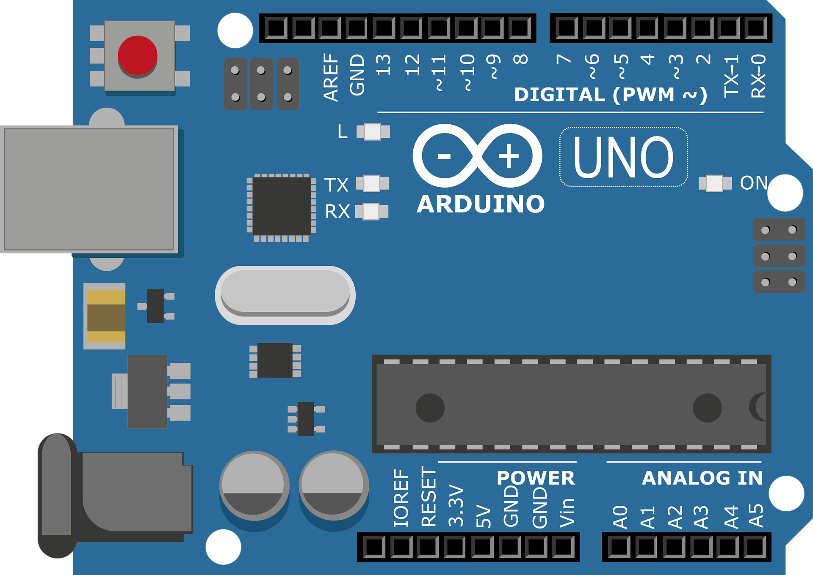

<h1>LED_Blink, "Hello World" di Embedded System</h1>

Pada pertemuan sebelumnya, LED dinyalakan dengan menghubungkannya langsung ke sumber tegangan Arduino. Cara ini membantu kita mengenal pin daya dan ground serta cara menghubungkan komponen elektronik, tetapi fungsinya masih sangat sederhana.

Pada pertemuan ini, pembelajaran naik satu tingkat. LED tidak lagi menyala secara langsung, melainkan dikendalikan oleh program. Arduino akan mengatur tegangan pada pin GPIO sehingga LED dapat dinyalakan dan dimatikan sesuai perintah kode. Melalui kegiatan ini, kita mulai mempelajari dua keterampilan utama dalam sistem mikrokontroler, yaitu merancang rangkaian elektronik dan membuat program yang mengontrol rangkaian tersebut.

Pada tugas pendahuluan, sebuah LED diperlukan. Dalam hal ini, anode pada LED (berkaki Panjang) dihubungkan pada pin 12 dan katoda (berkaki pendek) dihubungkan ke pin GND seperti yang terlihat pada Gambar.

<h2>Membuat Rangkaian</h2>

<h2>Alat dan Bahan</h2>
<table border="1" cellpadding="10" cellspacing="0" width="100%">
  <tr>
    <th>Arduino</th>
    <th>LED</th>
    <th>Resistor</th>
  </tr>

  <tr align="center">
    <td>
       
    </td>
    <td>
       
    </td>
    <td>
       
    </td>
  </tr>

  <tr align="center">
    <td>Arduino Uno, Leonardo, atau lainnya</td>
    <td>Red LED</td>
    <td>220Ω Resistor atau lainnya</td>
  </tr>
</table>

Pastikan sambungkan wiring kabel sesuai dengan petunjuk berikut:
<ul>
  <li>(+) LED -------------- Pin 12</li>
  <li>(-) LED -------------- Resistor</li>
  <li>Resistor ------------- Pin GND</li>
</ul>

Pada tahap berikutnya, LED akan dikendalikan menggunakan program. Kita akan membuat kode C/C++ pada Arduino sehingga Pin 12 diberi tegangan 5V secara otomatis, yang menyebabkan LED menyala.

<h2>Install Arduino IDE</h2>

Sebelum mulai memprogram Arduino, pastikan <a href="https://support.arduino.cc/hc/en-us/articles/360019833020-Download-and-install-Arduino-IDE">Arduino IDE</a> sudah terpasang di komputer Anda. Jika belum, unduh dan instal Arduino IDE dengan mengikuti panduan instalasi yang disediakan secara bertahap melalui tautan berikut <a href="https://support.arduino.cc/hc/en-us/articles/360019833020-Download-and-install-Arduino-IDE#installation-instructions">disini</a>

<h2>Pengenalan GPIO</h2>

Pada tahap ini, kita mulai menyalakan LED menggunakan program dengan memberikan logika HIGH (5V) pada Pin 12. Selanjutnya, program tersebut akan diubah sehingga LED tidak hanya menyala terus, tetapi juga dapat berkedip. Untuk itu, kita perlu memahami konsep keluaran digital pada Arduino.

Arduino Uno memiliki 20 pin GPIO yang dapat digunakan untuk menerima atau mengirim sinyal digital, yaitu HIGH dan LOW. Sinyal ini dikendalikan melalui fungsi digitalRead() untuk membaca dan digitalWrite() untuk menulis nilai digital.

Walaupun pin digital lain juga bisa digunakan, Pin 12 dipilih agar konsisten dengan pelajaran selanjutnya, sehingga proses belajar menjadi lebih sederhana dan tidak membingungkan.

Anda dapat mengendalikan salah satu dari 20 pin digital I/O tersebut dengan menggunakan tiga fungsi berikut:

<ul>
  <li>pinMode(int pin, int mode). Fungsi ini digunakan untuk mengatur sebuah pin agar berfungsi sebagai INPUT atau OUTPUT. Dalam kasus ini, kita memilih OUTPUT karena kita ingin mengirimkan sinyal untuk menyalakan LED.</li>

<li>digitalRead(int pin). Fungsi ini digunakan untuk membaca sinyal digital dari pin tertentu, yaitu HIGH atau LOW. Fungsi digitalRead akan dibahas lebih lanjut pada seri pelajaran pengantar input.</li>

<li>digitalWrite(int pin, int value). Fungsi ini digunakan untuk mengirimkan sinyal digital ke pin tertentu, yaitu HIGH atau LOW. Pada pelajaran ini, kita akan menggunakan fungsi digitalWrite.</li>
</ul>

<h3>Bagaimana kita menghitung 20 pin I/O digital?</h3>

Pada Arduino Uno dan Leonardo, tulisan dan label pada papan sering membuat kita mengira hanya ada 14 pin digital. Padahal, jika dilihat secara keseluruhan, terdapat 20 pin digital I/O yang bisa digunakan. Untuk memastikan hal ini, kita dapat melihat diagram pinout resmi Arduino Uno yang menunjukkan semua pin yang tersedia.

Untuk lebih jelasnya, berikut pin I/O digtial dan analog

<h2>Menghidupkan dan Mematikan LED pada Pin 12 Dengan Menggunakan Program</h2>

LED Blink sebagai project Hello World di Embedded System dapat disimak sebagai berikut:

<table border="1" align="center" width="100%" cellpadding="0" cellspacing="0">
  <tr>
    <td>
      <h2>
        <a href="led_blink.ino">
          LED Blink Dengan Arduino
        </a>
      </h2>
    </td>
  </tr>
</table>

<h2></h2>

