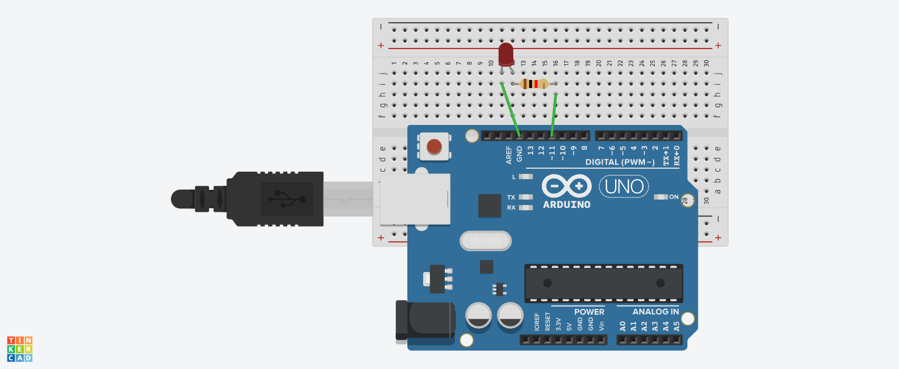

<h1>LED_Blink, "Hello World" di Embedded System</h1>

Pada pertemuan sebelumnya, LED dinyalakan dengan menghubungkannya langsung ke sumber tegangan Arduino. Cara ini membantu kita mengenal pin daya dan ground serta cara menghubungkan komponen elektronik, tetapi fungsinya masih sangat sederhana.

Pada pertemuan ini, pembelajaran naik satu tingkat. LED tidak lagi menyala secara langsung, melainkan dikendalikan oleh program. Arduino akan mengatur tegangan pada pin GPIO sehingga LED dapat dinyalakan dan dimatikan sesuai perintah kode. Melalui kegiatan ini, kita mulai mempelajari dua keterampilan utama dalam sistem mikrokontroler, yaitu merancang rangkaian elektronik dan membuat program yang mengontrol rangkaian tersebut.

Pada tugas pendahuluan, sebuah LED diperlukan. Dalam hal ini, anode pada LED (berkaki Panjang) dihubungkan pada Pin 11 dan katoda (berkaki pendek) dihubungkan ke pin GND seperti yang terlihat pada Gambar. LED akan dikendalikan menggunakan program. Kita akan membuat kode C/C++ pada Arduino sehingga Pin 11 diberi tegangan 5V secara otomatis, yang menyebabkan LED menyala.

<h2>Membuat Rangkaian</h2>

<h2>Alat dan Bahan</h2>
<table border="1" cellpadding="10" cellspacing="0" width="100%">
  <tr>
    <th>Arduino</th>
    <th>LED</th>
    <th>Resistor</th>
  </tr>

  <tr align="center">
    <td>
       
    </td>
    <td>
       
    </td>
    <td>
       
    </td>
  </tr>

  <tr align="center">
    <td>Arduino Uno, Leonardo, atau lainnya</td>
    <td>Red LED</td>
    <td>220Ω Resistor atau lainnya</td>
  </tr>
</table>

Pastikan sambungkan wiring kabel sesuai dengan petunjuk berikut:
<ul>
  <li>(+) LED -------------- Resistor</li>
  <li>(-) LED -------------- Pin GND</li>
  <li>Resistor ------------- Pin 11</li>
</ul>

<h2>Menghidupkan dan Mematikan LED pada Pin 11 Dengan Menggunakan Program</h2>

https://github.com/user-attachments/assets/d73ae3f6-8689-45e6-a6dd-03096f7abbfc

LED Blink sebagai project Hello World di Embedded System dapat disimak sebagai berikut:

<table border="1" align="center" width="100%" cellpadding="0" cellspacing="0">
  <tr>
    <td>
      <h2>
        <a href="led_blink.ino">
          LED Blink Dengan Arduino
        </a>
      </h2>
    </td>
  </tr>
</table>

<h2>Pembelajaran Selanjutnya</h2>

Pada pembelajaran selanjutnya yang akan dipelajari dan dipraktikan adalah komunikasi serial. Praktikum komunikasi serial pada Arduino adalah metode pembelajaran pengiriman data bit demi bit secara berurutan, biasanya melalui kabel USB antara Arduino dan komputer, untuk memantau sensor atau mengontrol output (LED/motor) secara real-time. Praktikum ini menggunakan Serial Monitor di Arduino IDE untuk komunikasi dua arah, sering kali menerapkan fungsi Serial.begin(), Serial.print(), dan Serial.read().

LED Blink sebagai project Hello World di Embedded System dapat disimak sebagai berikut:

<table border="1" align="center" width="100%" cellpadding="0" cellspacing="0">
  <tr>
    <td>
      <h2>
        <a href="led_blink.ino">
          Next: Serial Communication
        </a>
      </h2>
    </td>
  </tr>
</table>
<h2></h2>

